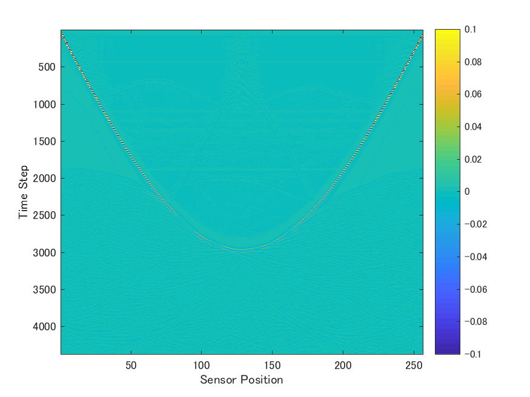

# USCTSim

MATLAB simulation program for USCT using [k-Wave](http://www.k-wave.org/, "k-Wave")

## Environment (certified)

* Windows 7
* MATLAB R2017a
* K-Wave ver1.2

## How to use

### 1. Load sample parameter

```matlab
>> load('sample_param.mat')
>> param
         grid: [1×1 struct]
       medium: [1×1 struct]
           io: [1×1 struct]
    ringarray: [1×1 struct]
        t_end: 1.0000e-04
       sensor: [1×1 struct]
       source: [1×1 struct]
```

### 2. Edit paramters

Below shows example of selecting source points.

```matlab
>> param.source.point_map = 1:128:256
```

### 3. Execute simulation

```matlab
>> simulate_usct(param, 'result')
```

### 4. check out results

```matlab
>> load('result\rfdata.mat')
>> size(rfdata)

ans =

        4374         256         2
```

result/step001/rf.png

